## Introduction

This workshop will introduce you to key self-service features in Oracle Analytics Server and illustrate what happens at JTC America Group, a fictional conglomerate with operations in multiple geographies and segments spanning a broad product portfolio.

Estimated duration: 45 minutes

**Workshop objectives**

In this lab, you will explore the following features and capabilities:

* Data Visualization, Mash-Ups, Trendlines and Forecasts
* Custom calculations and maps
* Automatic previews

## Exercise 1: Data Visualization and Mash-Ups

To start our analysis, we will create a workbook. Think of a workbook as a dashboard. A workbook can contain a variety of objects, including filters, text boxes, and other types of visualizations.

1. **Click** on *"Create"* at the top right.

    

2. **Click** on Workbook to start a new self-service workbook.

    

3. **Select** the Subject Area "Sample App" and **Click on** "Add to Workbook".

    Sample App provides access to the data that we will use to carry out our analysis.

    

4. An empty canvas is displayed. Let's start visualizing! First, let's see how product ratios are distributed among different product types.
    1. **Select** “Products – Product Type” and “Profit Metrics – Profit Ratio %”.
    2. **Right-click**, then “Pick Visualization”.

        

5. **Choose** the “Donut” graphic.

    

6. Observe the graph on the canvas. You can see that of all the product ratios, “Audio” has the lowest profit ratio percentage.

    

7. Now let's try to dig deeper and understand why the profitability ratio of audio products is lower than our other types of products. Let's see how products in the "Audio" category have performed over time.

    Expand Time, Products, and Profit Metrics, then **select** *Product*, *Month*, and *Profit Ratio %*. Then **drag** them to the left of the donut graphic.

    A green line appears. It identifies the location of your visualization. You can drop the visualization to the left, right, top, or bottom of the previous visualization.

    
   
    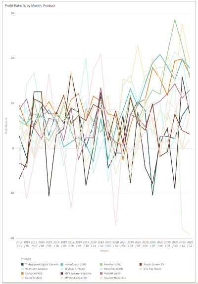
   

9. Oracle Analytics Server provides adaptive graphing capabilities. Since we want to look at our metric over a period of time, Oracle Analytics has chosen to present the results as a line graph depicting the profit ratio month over month.

    Next, we want to look at the profit ratio for each product separately to get more details.

    **Drag** "Product" to **Trellis Rows**. You should see an individual chart for each product, as shown in the image.

    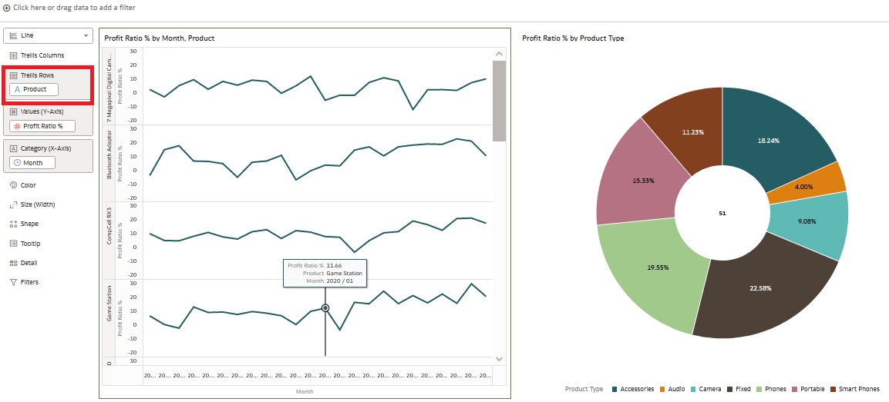

    Since we are interested in the profitability ratio of the “Audio” product type, we will filter down to the product level. To do this, **drag** “Products – Product Type” to the filters section and select “Audio”.

    

    Observe that “MicroPod” has declining profit ratios and “SoundX Nano” could also be improved. There may be several reasons for this.

10. We continue our investigation by looking at product stock levels. JTC America uses a third-party system that captures data regarding inventory levels and product demand. I need this data to complete my analysis. Oracle Analytics allows you to quickly access inventory data and combine it with our current analysis, all within a single platform.

    From the data elements panel, Click on "+" and "Add Data" to import all inventory data into your Workbook.

    

12. **Click** on “Create Data Set” then “Drop data file here or click to browse”.

    

    

    Select the *“Inventory.xlsx”* file. Open the file.

    

    Once the spreadsheet is downloaded, click "Ok" at the bottom left of the window.

    

    Then Save the Dataset by clicking at the top right of the screen and name your Dataset “Inventory”

    

    

14. Return to the "New Workbook" tab located above the Workbook area.

    Note that the “Inventory” Dataset is available to add to the Workbook.

    **Select** "inventory" and click "Add to workbook"

    Let's define a relationship between the Subject Area - SampleApp and the Dataset inventory to link the data sources for further analysis.

    At the top and middle of the Workbook, you will notice three navigation options - "Data" "Visualize" and "Present"

    **Click** on “Data”

    

    In Data, you can identify key data elements and attach your data sources. Oracle Analytics will attempt to locate data elements that are labeled the same and will automatically perform the join if identical data element labels are found.

    Notice the data diagram. The data diagram provides a graphical representation of your data sources and their connections. Note that there are no connections. Move your cursor between the "SampleApp" and "Inventory" data sources.

    No matches were identified, so we need to create our own.

    1. **Click** on "0' between the two data sources.
    2. **Click** “Add Another Match”

        

        From inventory

    3. **Click** on “Select Data” and select the “ProductName” column.

        

        Perform the same steps on "SampleApp" and select "Products - Product" to link the data sources.
   
       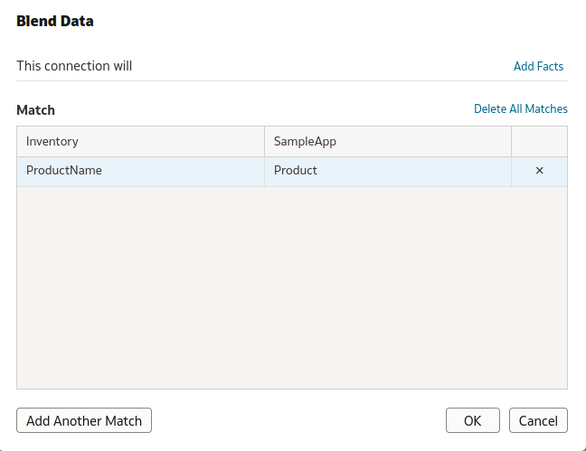
       
        You will notice that the data sources are attached.

    5. **Click on** “Visualize”.

        

    6. Explore the Data Elements panel on the left. Note that the Inventory worksheet is listed under SampleApp.

        

15. Now that we have successfully joined our dataSo, let's continue our analysis. Hold **control and select** "Product -\> Product" in SampleApp and "Stock" and "Demand" in Inventory.
    1. **Click** **right** and **Select** “Pick Visualization”.

        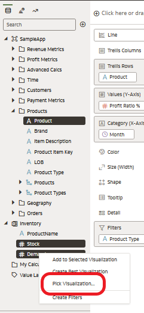

    2. **Select** "Bar"

        

16. Notice grammar panel for bar visualization. By placing the "Stock" and "Demand" metrics respectively on the y-axis, the chart should look as shown in the image.

    

    **Right click** on any bar representing "demand" and sort -\> "demand" -\> "Low to High".

    

    See that the graph sorts itself based on demand, from lowest to highest.

    

    The bar chart shows that for "MicroPod" and "SoundNano" the demand is higher than the current stock level.

    For other products, the relationship between inventory and demand is not much different. We are curious as to why stock levels for both products are lower than current demand.

17. We decide to study debts and receivables. To continue our analysis, we import the outstanding vendor payments spreadsheet that we obtained from our financial system.

    **Import** the *VendorPayments.xlsx* spreadsheet by repeating steps 9 through 12. You should now see the data set for Vendor Payments appear in the Data Elements panel of the screen. welcome to the workbook.
    
    

    

19. Let's create a visualization to analyze products and supplier payments.

    Expand Products and VendorPayments, select *Product* and *OutstandingPayment*. Then, **Right** Click and **select** “Pick Visualization.”

    

    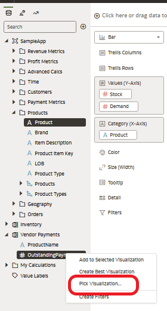

21. Select “Tag Cloud”.

    

    

23. You should see a new visualization on the canvas. The visualization shows that **MicroPod** and **SoundX** **Nano** are the products with the highest number of outstanding supplier payments.

    Our suppliers may not be willing to ship ordered quantities if there are significant account delinquencies.

    We must take steps to resolve these payment issues.

    To complete our analysis, we would like to provide some further measurements and information.

    Let's forecast the profit ratio and revenue performance for the coming months. Oracle Analytics Server offers easy-to-use advanced analytical functions, such as trendline, forecast, clustering or outlier detection.

24. Let's start by adding a new canvas. Think of an outline as an extra page in the workbook or an extra slide in a PowerPoint presentation.

    **Click** on the "+" icon located at the bottom of the screen to create a new canvas. On the new canvas, **Click** on the inverted triangle to the right of its name. Select “Canvas Properties".

    

25. **Click** “Auto Fit” and change it to “Freeform.” **Click** “Okay”.

    
    
27. **Select** “Profit Ratio %”, “Revenue” and “Month”. Right-click and select “Pick Visualization”. **Select** "Combo."

    

    Note that in "freeform" mode, the entire canvas is not used automatically.

28. From the grammar panel **Right click on** "Profit Ratio %" and select "Y2-Axis." Widen the visualization for a better view.

    

29. **Select** the “Analytics” option in the left navigation panel. Drag and drop “Trend Line” onto the visualization.

    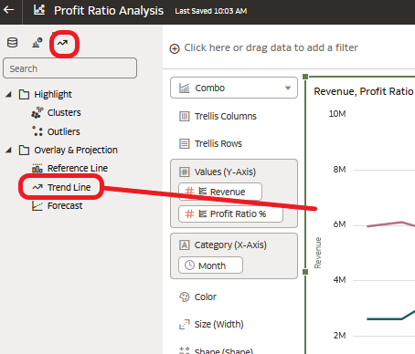

30. You have now created a management report that presents both the revenue and profitability ratio in % with their corresponding trend lines, all without coding.

    **Drag and drop** “Forecast” onto the visualization and you will see the predicted results for both metrics. This may take a few moments, please be patient.

    

    Review the properties. You will notice that the forecast is for revenue and profitability ratio in % for the next three months. These variables can be modified according to the user's needs.

    

31. It appears that we are on the right track and our forecasts are promising. Next, we'll provide a historical overview of revenue performance using a custom calendar heatmap visualization that can be found in the Oracle Analytics Extensions library.

    **Note:** We have added custom visualization in the environment for you. If you would like to learn how to upload custom visualization types, please see the section at the end of this document.

    Let's start by adding a new canvas. Click the "+" icon at the bottom to create a new canvas.

    

32. Expand Time and Revenue Metrics, **Select** *Date* and *Revenue*. Then, **Right-Click** and select “Calendar Heatmap”.

    

    

## Exercise 2: Custom calculations and use of Maps

Oracle Analytics Server offers advanced mapping capabilities and the ability to create custom calculations.

1. In this exercise, we will create two custom calculations and then use Oracle's built-in self-service charting capabilities to analyze health and average profit per customer.

    Let's start by adding a new canvas.

    **Click** on the "+" icon at the bottom of the page to create a new canvas.

    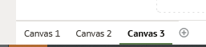

2. **Right-click** on “My Calculations”. **Select** "Add Calculation".

    

3. We'll use the Expression Builder to create a new metric called "Profit by Customer Count." You will notice that there is a wide range of functions for creating custom calculations.
4. **Select** "Profit Value" from "Profit Metrics" and **drag**/**drop** into the boxne calculation dialog. Enter "/" after "Profit Value" then drag/drop "\# of Customers" from "Revenue Metrics" after the "/." Click Validate. Click Save.

    You have successfully created your custom calculation which can be used like any other measurement.

    

5. Let's use our custom calculation in some visualizations.

    **Select** "Country Name" in "Geography". Drag and drop it to the top left of the canvas, just above the canvas, where it says "Click here or drag data to add a filter." **Filter** for "United States" by entering "uni" and select "United States".

    

    

6. **Select** "State Province" from "Geography" and your new custom calculation under "My Calculations." Drag and drop them onto the canvas. Note that not all states make a profit.

    

    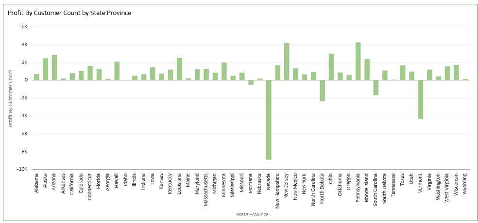

    Let's see how this looks on a map.

7. In the upper right corner of the visual, **click** on the three vertical dots and select "Edit" then "Duplicate Visualization".

    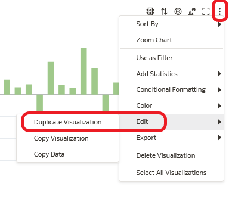

8. Change the visualization type by selecting "change visualization" in the upper left corner of the grammar panel.

    **Select** map.

    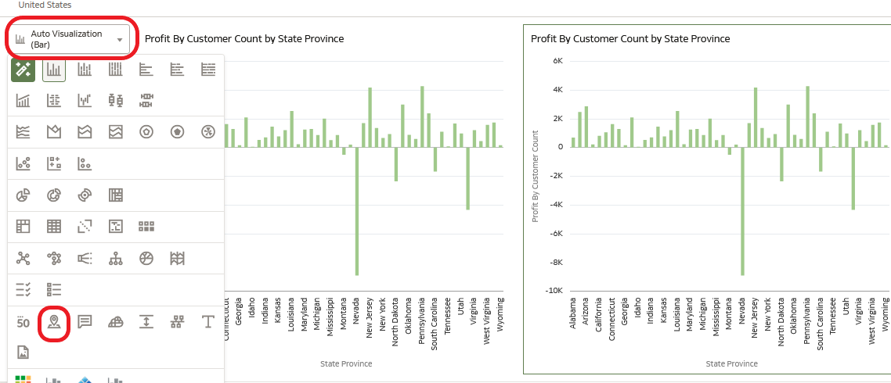

9. Let's change the default color palette of our map visualization to have a red to green gradient. From Color, Click the down arrow \> Manage Assignments.

    

10. Under Series, locate the metric you created: Profit by Customer Count
    1. **Click** the Down arrow next to the color bar.
    2. **Select** the red to green gradient second from the bottom right.
    3. **Click** “Done”.

        
   
       

11. There are several ways to filter information to obtain information on different attribute groups and aggregation levels. The canvas is an extremely dynamic and interactive palette.

Remember, at the beginning of the exercise we looked at the profit ratio by product, and we added a filter to a specific visualization to look at the profit ratio for products categorized under the Audio product type. (Steps 1-8).

In this lab, we added a filter to our canvas to examine measures specific to the United States.

Users can quickly interact with visualizations to create slices or subsets with just a few mouse clicks to gain deeper insights.

Return to canvas 1.

**Right-click** on the "Audio" sector of the graph and select "Keep Selected".

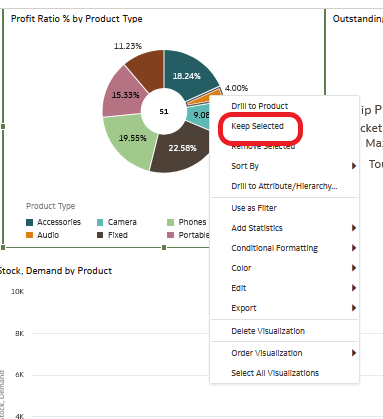

Notice that each object changes interactively depending on the selection of the "Audio" sector of the graph.

Clear your filter by **right-clicking** on the "Audio" sector and **selecting** "Remove Selected".

11.**Click** on the "Save" icon at the top right of the screen to save your workbook.

You have successfully created a workbook.

12. Activate the "auto-save"

## Bonus Exercise: Auto Insights

So far we have created a workbook based on a defined and specific scenario. We asked questions and got answers.

This gave us actionable insights into declining profitability ratios at JTC Americas.

Can you remember a time when, when presented with a data analysis task, you weren't sure exactly how or where to start when faced with a large data set?

Oracle Analytics Server can automatically provide powerful insights into any data set in the system using a feature called Auto Insights.

Auto Insight is a handy tool for understanding your data and is a great starting point for analysis.

When you create DataSets or add DataSets to a Workbook, Oracle Analytics Server evaluates the dataset and generates several suggestions through a visualization map and a natural language descriptive summary. The summary explains the relationship between attributes, metrics, and points of interest.

1. Let’s start by creating a dataset with the worksheet titled – ‘sampleOrderLines.xlsx’.

    

    

    

2. For this exercise, we will leave it as is. Add it to Oracle Analytics Server and create a workbook.

    

    **Click** on OK then save it.

    

    

    Once saved, you can click on “Create Workbook”

    

    Notice the white light bulb icon in the upper right corner. After Auto Insights evaluates the dataset, the icon turns yellow, indicating that Oracle Analytics Server has identified a set of suggested insights.

3. **Click** Auto Insights to review the ideas suggested in the far right panel.

    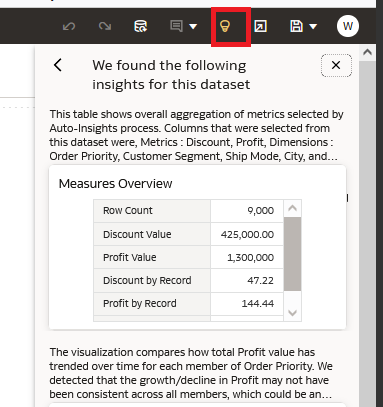

    Each visual overview is accompanied by a natural language summary describing the insight into the function that each visualization provides. Hover over the text to see the full description.

    If you are interested in a specific preview, simply click the + icon in the visualization or drag the visualization directly into the canvas.

    Create a canvas by selecting certain information. Add the following:

    1. Measurements Overview
    2. Trending Dimensions
    3. City Scatter Plot Chart
    4. Top 10 City by Profit

        When you're done, minimize the AutoPreviews panel.

        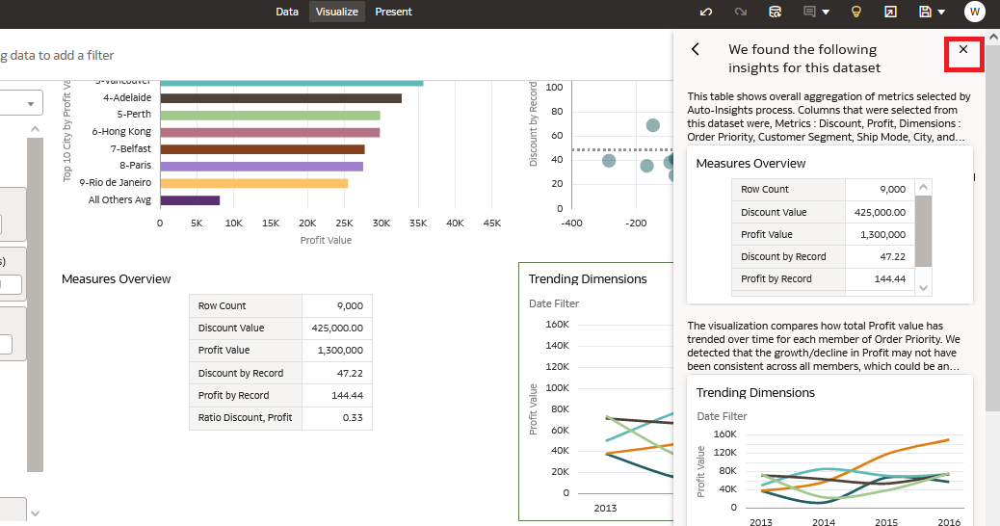

        You will notice that each preview exists in the canvas as if you had created each visualization object manually.

4. Hover over the title of each preview to view its natural language summary. You can add a text box to display the summary in n-languagenatural in your workbook.

    Select the viewing menu on the far left, then select "Text Box." Drag the text box above Trending Dimensions.

    

    Copy (Ctrl-C) the text in the Title Tooltip field in the left-hand data panel (properties) of the workbook designer and paste (Ctrl-P) it in the 'Edit Text' box within the visualization.

    

    You can edit the text box as you wish.

    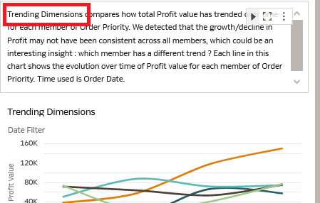

    Navigate to the far left and explore the Data Elements panel, then scroll to the bottom.

5. Open ‘MyCalculations’.

    

    Notice that the corresponding custom calculations have been carried over to the Data Elements panel following your visualization selections.

    Like any canvas, elements and objects can be filtered or modified according to your needs. You can use insight visualization objects as a template to duplicate or modify visualization objects based on your analysis needs.

    Right click on the 'Top 10 City by Profit Value' calculation. Note that you can edit the calculation, duplicate it, or copy it to the clipboard.

    Select 'Edit the Calculation. You can see the syntax and functions used for each calculation.

    

    

    Let's change the calculation and look at top 5 cities by profit value. Save the calculation.

    

    Don't forget to change the visualization name.

    Navigate to Data Prep and edit the metadata.

    From the middle screen, **Click** data. **Click** on the pencil icon to navigate to view the data.

    

    Navigate to the metadata view, hint - top right.

    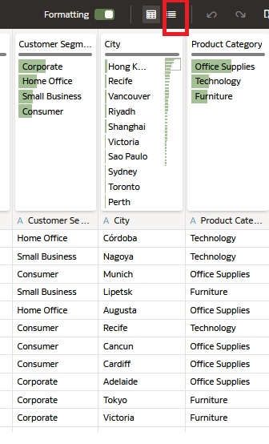

    Make the following changes:

    1. Discount: change the aggregation from 'Sum' to 'Average'
    2. Rename 'Sales' to 'Revenue'
    3. Hide 'Product Sub Category'

        Save your Dataset.

6. Once you have saved, return to your workbook via the workbook opening window and click on “visualize”.

    

    Notice the changes to your workbook, and the light bulb icon is white again. Auto Insights runs automatically and re-evaluates your data.

    The light bulb icon will turn yellow and provide new information when complete.
