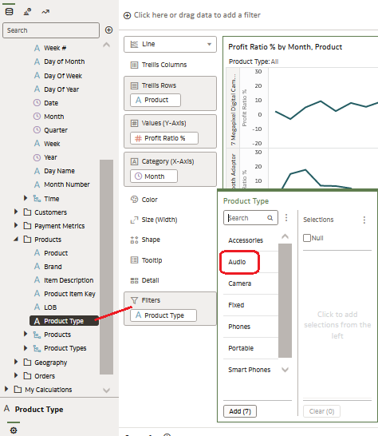

## Introduction

This workshop will introduce you to key self-service features in Oracle Analytics Server and illustrate what happens at JTC America Group, a fictional conglomerate with operations in multiple geographies and segments spanning a broad product portfolio.

Estimated duration: 45 minutes

**Workshop objectives**

In this workshop, you will explore the following features and capabilities:

* Data Visualization, Mash-Ups, Trendlines and Forecasts
* Custom calculations and maps
* Automatic previews

## Exercise 1: Data Visualization and Mash-Ups

To start our analysis, we will create a workbook. Think of a workbook as a dashboard. A workbook can contain a variety of objects, including filters, text boxes, and other types of visualizations.

1. **Click** on *"Create"* at the top right.

 

2. **Click** on Workbook to start a new self-service workbook.

 

3. **Select** the Subject Area "Sample App" and **Click on** "Add to Workbook".

 Sample App provides access to the data that we will use to carry out our analysis.

 

4. An empty canvas is displayed. Let's start visualizing! First, let's see how product ratios are distributed among different product types.
 1. **Select** “Products – Product Type” and “Profit Metrics – Profit Ratio %”.
 2. **Right-click**, then “Pick Visualization”.

 

5. **Choose** the “Donut” graphic.

 

6. Observe the graph on the canvas. You can see that of all the product ratios, “Audio” has the lowest profit ratio percentage.

 

7. Now let's try to dig deeper and understand why the profitability ratio of audio products is lower than our other types of products. Let's see how products in the "Audio" category have performed over time.

 Expand Time, Products, and Profit Metrics, then **select** *Product*, *Month*, and *Profit Ratio %*. Then **drag** them to the left of the donut graphic.

 A green line appears. It identifies the location of your visualization. You can drop the visualization to the left, right, top, or bottom of the previous visualization.

 

8. Oracle Analytics Server provides adaptive graphing capabilities. Since we want to look at our metric over a period of time, Oracle Analytics has chosen to present the results as a line graph depicting the profit ratio month over month.

 Next, we want to look at the profit ratio for each product separately to get more details.

 **Drag** "Product" to **Lattice Rows**. You should see an individual chart for each product, as shown in the image.

 

 Since we are interested in the profitability ratio of the “Audio” product type, we will filter down to the product level. To do this, **drag** “Products – Product Type” to the filters section and select “Audio”.

 

 Observe that “MicroPod” has declining profit ratios and “SoundX Nano” could also be improved. There may be several reasons for this.

9. We continue our investigation by looking at product stock levels. JTC America uses a third-party system that captures data regarding inventory levels and product demand. I need this data to complete my analysis. Oracle Analytics allows you to quickly access inventory data and combine it with our current analysis, all within a single platform.

 From the data elements panel, Click on "+" and "Add Data" to import all the inventory data into your Workbook.

 

10. **Click** on “Create Data Set” then “Drop data file here or click to browse”.

 

 Select the *“Inventory.xlsx”* file. Open the file.

 

 Once the spreadsheet is downloaded, click "Ok" at the bottom left of the window.

 

 Then Save the Dataset by clicking at the top right of the screen and name your Datas