# Self-service data preparation, data enrichment and modeling

## Introduction

Database analysts and administrators spend a lot of time assembling and preparing data for analysis. Therefore, the ability to quickly access, leverage and make sense of the volumes and variety of data available today is essential to maintaining a competitive advantage in today's marketplace.

Oracle Analytics Server provides powerful visual data management capabilities allowing users to create new data sets dynamically and quickly.

This exercise will introduce you to the key capabilities of self-service data management within Oracle Analytics Server.

## Create and enrich a Dataset

In this chapter, we will start with the basics of uploading a spreadsheet to Oracle Analytics Server. Once the upload is successful, we will review the data elements and explore some of the data transformation and enrichment capabilities that enable a smooth and seamless data preparation process.

1. Click *"Create"* in the upper right corner.

    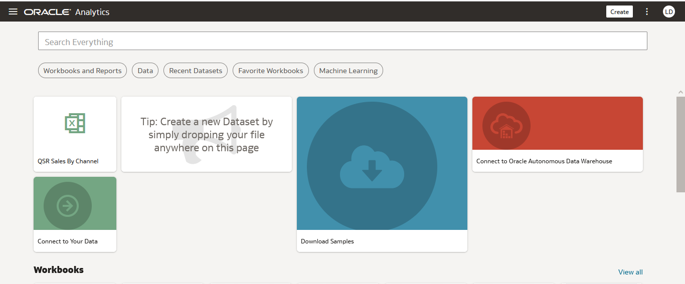

2. **Click** Dataset in the menu.

    

3. **Upload** the "employeeTermination.xlsx" spreadsheet.

    

    Once uploaded, click on the OK button

    

    Save your Dataset then click on “Employee Termination” at the bottom of the screen.

    

    After creating a dataset, it is subjected to column-level profiling to produce a set of semantic recommendations to repair or enrich your data. These recommendations are based on the system automatically detecting a specific semantic type during the profiling step. After profiling the data, you can modify it and implement the enrichment recommendations provided on the far right of the palette. Keep in mind that date-specific items and their semantic types will dictate the variety and number of recommendations you receive and can include in your dataset.

    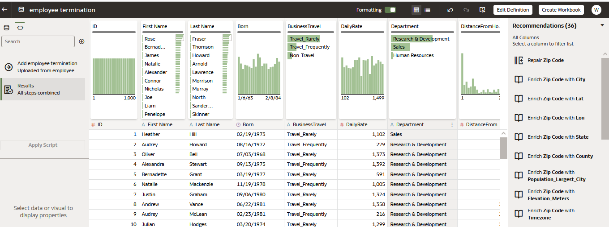

4. Use the scroll bar at the bottom of the screen and review the data items. Each item has been labeled with an identifier.
    - A = Attribute
    - '\#' = Measure
    - Clock = Time

        Make sure your data elements have been labeled correctly, as the assignment will control the properties and analysis options available during analysis.

        Use the scroll bar to locate the employee ID and number in the data source. Notice that each element has been marked with a \#, which indicates that Oracle Analytics Server has identified the element as a metric or numeric element. Employee numbers and IDs are generally not metrics to aggregate or summarize. These are attributes used for identification purposes.

        Change the data element ID for ID and Employee data elements.

        **Click** on the ID column. Notice the boxThe ID Properties tab is in the lower left corner. Let's change the identifier. Under the property 'Treat As'. **Click** on 'measure' and select attribute.

        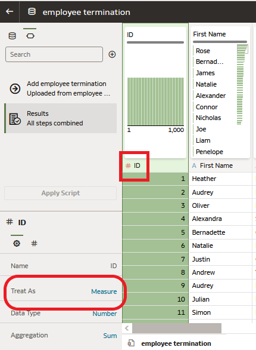

        Go ahead and locate the employee number, and make the same change.

        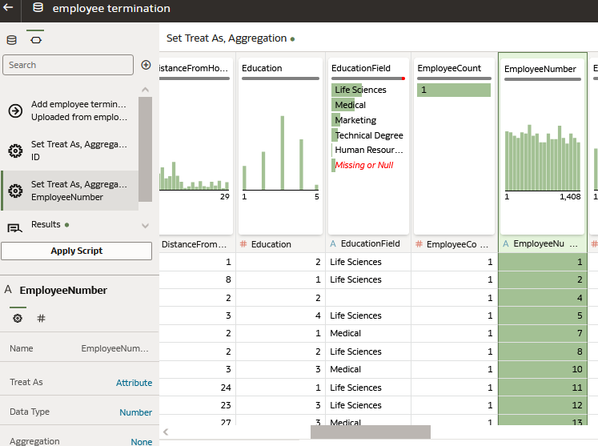

        As you review the remaining columns, you may find additional data elements to modify.

5. Keep scrolling right until you reach the end. Note that the data set includes social security number. **Click** on the column labeled SSN. The social security number is sensitive data and Oracle Analytics Server recognized this and issued 6 recommendations. You can choose to hide, delete or extract part of this data with a single mouse click.

    **Select** 'Obfuscate First 5 digits of SSN'

    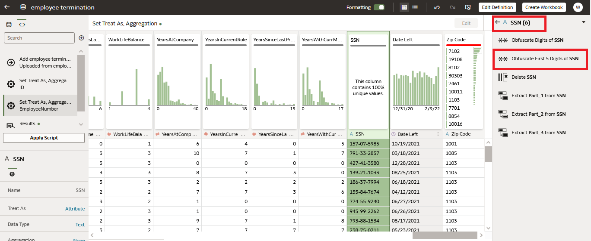

6. Further to the right, beyond the social security number, locate the ‘Zip Code’ column.

    Zip code was identified as an attribute, but some zip code records appear incomplete.

    You will notice above the column header that each data element has a data quality information sheet associated with it.

    This sheet provides a visualization illustrating information about the data element as well as information about the distribution of records. Additionally, it provides insight into the cleanliness of the records in each column.

    Note the red bar at the top of the data quality overview map. Hover over the red bar. Oracle Analytics Server detected invalid values ​​based on deep semantic knowledge provided by System Knowledge. System Knowledge provides an extensive set of geographic and demographic reference data used during the profiling process.

    **Click** zip code and review the recommendations provided by Oracle Analytics Server.

    Let's repair the Zip Code values ​​by selecting the 'Repair Zip Code' recommendation.

    

    Oracle Analytics Server corrected each zip code record in the column. Notice that the horizontal bar has changed from red to green.

    

    Additionally, I see that Oracle Analytics Server recommended enriching my dataset by providing many geographic name options, including city and state.

    Let's improve the dataset by using state and city recommendations for our analysis.

    In the recommendations panel, **click** on 'Enrich Zip Code with State', then 'Enrich Zip Code with City'.

    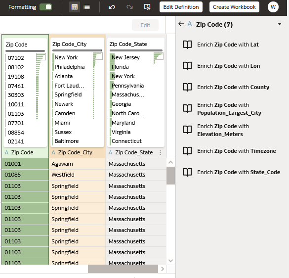

    We added two additional columns to our dataset.

    Next, we will rename each column label.

    Double-**Click** on the Zip Code_City column label.

    **Click** ‘rename’ – enter ‘City’

    Follow these steps to rename the Zip Code_State column label to State.

    **Right-click** on the Sate column label, Notice that there are a wide variety of transformation options!

    

    Return to the left of the dataset. Locate the “EducationField” column.

    Review the information provided in the Data Quality Overview card.

    Oracle Analytics Server identified missing or null values.

    The data quality bar indicates that 5% of records are zero values.

    You can replace null or missing values ​​by double-clicking "Missing or Null" and typing the replacement value.

    Double-**Click** 'Missing or Null' and enter 'Other'

7. Let's make one final modification to our dataset. Go back to the beginning of the dataset, all the way to the left.

    I want to combine the "First Name" and "Last Name" columns into a single column called "Employee Name".

    We will concatenate the columns to merge them.

    **Right-click** on 'First Name' and select 'concatenate'

    

    In the concatenate dialog box, make the following changes:

    - Give the column a new name – Employee Name
    - Let Merge Column with First Name
    - Change ‘With’ with Last Name
    - Leave the delimiter at Space ( )
  
      

    - Once finished, Click on ‘Add Step’

        **Right-click** on First Name and Last Name and select ‘Hide’

8. Next to ‘Employee Name’, there is the column ‘Born’.

    Let's change the column title to "birthdate". Follow the steps listed above to "rename" your column.

    Next, I would like to add a column that calculates ‘Age’.

    At the top left, you will notice a "+" icon in the script navigation panel.

    Review the items listed in the Scripts navigation pane. The script navigation panel recorded every change we made to the dataset. The changes reside in the dataset and will be applied when the data source is refreshed or added.

    

    **Click** on the + icon. The Create Column dialog box appears.

    Give the new column a name - Age

    Enter your calculation by simply typing in the box or using the functions listed in the table to the right.

    I would like to calculate age using today's date (current date) and the birthdate column. I need to use the year function to create my calculation.

    In the box, start typing "year." As you type, you will notice that Oracle Analytics Server offers choices corresponding to data entry. Select "Year" when this is an option.

    Notice that (dimension) appears next to Year. Let's use today's date function to specify the year.

    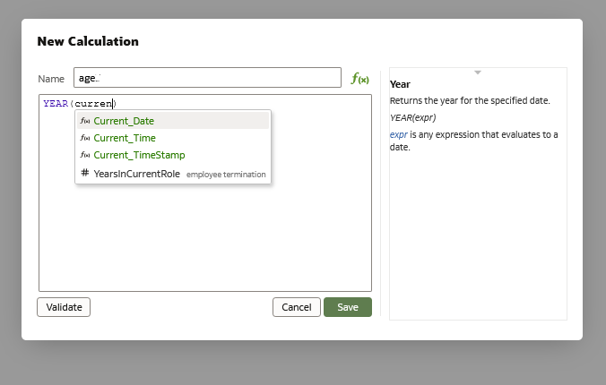

    Start typing "current". As you type, you should see options corresponding to "current". **Select** "current_date" when this is an option.

    Be sure to move your cursor outside of the parenthesis.

    - Enter a ‘ – ‘ for subtraction.

        To complete our calculations, we will use the year specified in Birthdate.

    - Repeat the steps above to create Year(Birthdate)

        Your entry should look like this:

        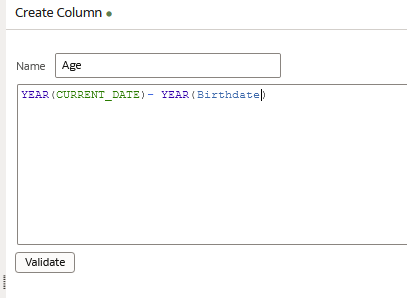

        Once finished, **click** on ‘Validate’. Ifthe calculation has been entered successfully, **click** on ‘Add Step’.

        I am very satisfied with my dataset. I made several changes and cleaned up my data. They are ready for analysis.

        We are now ready to analyze our data. **Click** Create - Workbook.

        

        You can begin your analysis by selecting the appropriate data elements.

        Examine the "birthdate" and "Date left" data elements listed in the control screen.

        Click on “Birthdate. Notice that Oracle Analytics automatically created a time dimension for the analysis.

        You can slice your data along various time dimensions without having to write code or transform your date-specific elements.

        

        Go back to the home page by clicking the "back arrow" on the top left - Choose the "Don't Save" option when asked about saving.

        

## Self-service Data Modeling

Oracle Analytics Server makes it quick and easy to create new datasets by adding tables from one or more connections to a dataset for analysis. This exercise explains how to gather data entities from one or more sources, select different tables, edit and join columns, and then preview the dataset.

Datasets can be combined with other datasets, saved and shared with others within the organization for analysis.

For this exercise, you will need a connection to an Oracle database. We're going to create that connection.

**Click** create in the upper right corner then **choose** Connection

Take a moment to browse the list of connections available in Oracle Analytics Server.

**Then click** on Oracle Database in the connection choices

**Enter** the connection information identical to the screen below and **click** on Save once done. The password is *Admin123*.

The connection is now created.

We can start the exercise.

1. Create - Dataset

    

    .

    **Click** on the orclpdb connection. The database has a large number of schemas. We will use SAMPLEAPP.

    

2. We want to analyze customer orders, products, revenue and billing information. I'm going to collect the tables I need to perform my analysis.

    Let's start by selecting the "CLOUD_D_CUSTOMERS" table. You can double-click it or drag it to the palette.

    Once selected, the table is represented by a diagram in the upper part of the palette. Below you will see the data elements that reside in the table.

    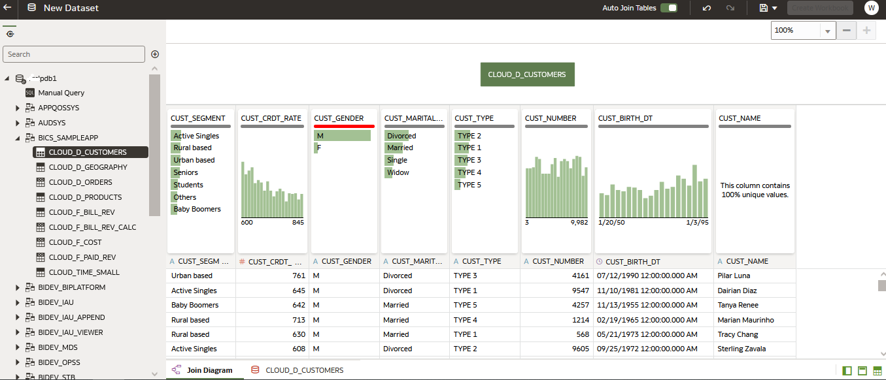

    We will then select the other tables we need. **Click** with the CTRL key pressed on the following tables:

    - *CLOUD_D_PRODUCTS*
    - *CLOUD_F_BILL_REV*
    - *CLOUD_TIME_SMALL*
    - *CLOUD_D_ORDERS*

        Once selected, **right-click** and select 'Add to dataset'

        

        Notice that a few joins have been challengedneated in the data source and therefore occurred automatically.

        

        **Click** or **hover** the connection point.

        *CLOUD_F_BILLREV and CLOUD_D_ORDERS are attached on Order_Status*

        

        *CLOUD_F_BILLREV and CLOUD_D_PRODUCTS are attached on PROD_ITEM_KEY*
        
        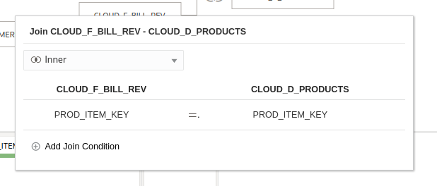
      
3. We need to manually add joins for the CLOUD_D_CUSTOMERS and CLOUD_TIME_SMAL tables.

    **Click on CLOUD_F_BILLREV. CUST_NUMBER is in the table. Notice that it is identified as a measure. To join CLOUD_F_BILLREV to CLOUD_D_CUSTOMERS we need to change the id**.**

    **Click** on the column name \#CUST_NUMBER and change the ID to Attribute.

    

    **Right-click** on CLOUD_D_CUSTOMERS and select Join To CLOUD_F_BILL_REV

    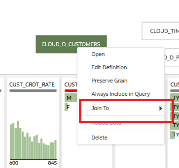

    Note that the join was suggested for you.

    

    **Right-click** on CLOUD_TIME_SMALL. Select Attach to CLOUD_F_BILLREV. No clear correspondence between date elements has been identified. Select CLOUD_F_BILLREV – TIME_BILL_DT and CLOUD_TIME_SMALL - DAY_TS

    Let's save our dataset so we can complete our analysis. **Click** the floppy disk icon in the upper right corner.

    Name your dataset - my new dataset

4. Before moving on to "Create Workbook", take a look at the bottom of the palette, where there are tabs representing all the tables you have selected.

    **Click** on the *CLOUD_D_CUSTOMERS* table.

    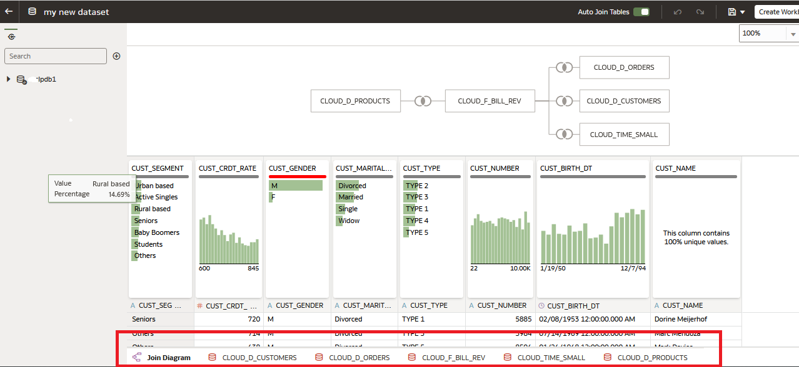

    Note the recommendations panel on the right. You can apply any of the recommendations provided by the knowledge engine.

    Additionally, you can click on 'Edit Definition'

    

    Notice the following:

    - You can add or remove columns in the data table.
    - You can change the data indicator if necessary.
    - You can change data access settings.

        

        **Click** Ok, then Create Workbook. If prompted, save the changes to the dataset.

        Look at the Data Elements panel on the left. Each table is represented by a folder icon.

        You are ready to begin your analysis.

        You can add other data sources to your analysis. **Click** on the + to the right of the search box.

        

        At this point you can:

    - Add a dataset
    - Use a subject area
    - create a new dataset, by selecting data from your local workstation or another data source.

        

        Oracle Analytics Server provides flexible and agile data management capabilities allowing users to access a wide variety of data sources andbring them together.
