# Augmented analysis using Machine Learning

## Introduction

One of the most sophisticated features that Oracle Analytics offers is the ability to leverage advanced analytics and machine learning at the click of a button, directly from your self-service projects and datasets. . Machine learning features include a set of predefined algorithms that can be used to extract insights from your data sets, such as sentiment analysis, time series analysis, prediction results, and score scores. trust.

Advanced analytics features like forecasting, trending, and clustering can be applied to visualization in your canvas with just one click. Additionally, users can call custom machine learning scripts using the script evaluation feature from your self-service projects or by adding custom scripts as part of your data flow during preparation Datas..

## Use Machine Learning to accelerate analysis

In this chapter, we will import a dataset containing multiple employee records with various attributes that record employee experience, performance, and incentives. The data is historical and includes an element that identifies whether the employee has left the organization.

- Note the attrition column, a binary indicator.
- Each employee record contains a "yes" or "no" answer.

Once you import your data into Oracle Analytics, you begin by profiling the data and reviewing semantic recommendations to repair and enrich your data for further analysis. Next, you'll take advantage of an enhanced analysis capability called explain. Explain is used to generate insights through a combination of natural language processing, descriptive statistics, and predictive modeling techniques to better understand our data and gain deeper insights before our analysis.

1. select Create..Workbook.

    

2. select Create Dataset.

    

3. Select the file *“AttritionTrainingV3.xlsx”*

    

    Click Ok to add the file to the dataset.

    

    Once done, save the file and name it “AttritionTrainingV3”.

4. Now locate the ID column and click on the hamburger icon at the top of the column. Let's hide this column since the ID column has no bearing on whether an employee stays or leaves our organization.  
    **Note**: This same procedure can be applied to any column that you believe does not impact attrition.

    

    Similarly, find the Age column and using the properties panel in the lower left corner, change "Treat As" to Attribute and "Data Type" to Text. This is because an employee's age can actually impact attrition, so assessing each distinct age of an employee could be deterministic.

    

    Oracle Analytics displays a set of useful column transformations called "Recommendations" when it detects patterns in your data. These recommendations are displayed in a pane on the right. Find the SSN column and select the “Obfuscate Digits of SSN” recommendation to hide this sensitive information from prying eyes. Save the changes we made to the Attrition dataset.

    

    **Note**: These helpful recommendations represent a key differentiator for Oracle and are designed to improve end-user productivity while helping customers get more value from their data.

5. Now let's create a workbook using the dataset we just improved by clicking on the "Create Workbook" button at the top right.

    

    A new workbook will be opened and the focus should be set to "Visualize" by default. If not, just choose "Visualize" at the top of the page

    

    In the "Data Elements" panel on the left side, find the Attrition attribute, then right-click it and select "Explain Attrition".

    

6. This operation generates an explanation window that provides information about attrition. This information is divided into 4 categories. The first category identifies the basic facts about our attrition attribute. In this case, it performs automatic aggregations on separate lines.

    

    Since attrition is a binary “yes/no” variable, it presents a pie chart showing the distribution of employees who left or did not leave the company. Scroll down to see more charts generated by Explain. You can select any interesting information you want to share or analyze in more detail by clicking the check mark in the upper right corner of each chart.

    Navigate to the second tab, which identifies key factors related to the attrition attribute. Oracle Analytics leverages machine learning to identify variables with the most deterministic relationship to attrition factors. Bar charts provide a distribution of attrition for each key factor.

    

    **Note:** Disregard screen order and location for graphics delivered via "Explain".

    Explain also generates segment insights, identifying similarities or grouping profile scenarios where attrition is more or less likely to be a yes or no.

    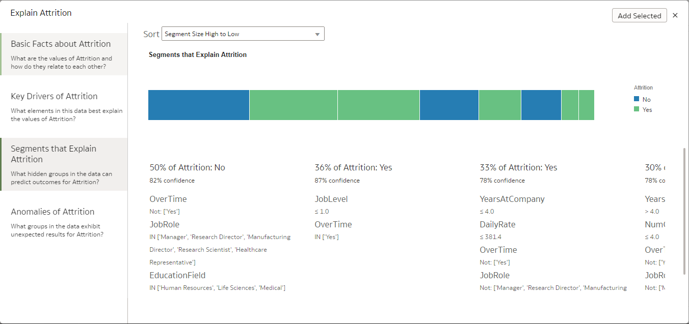

    You can use the drop-down menu to move between groups of segments to identify the confidence level of the scenario.

    The fourth category of information illustrates attrition anomalies or perhaps unexpected items. The fault indicator indicates the combinisons of each distinct attrition value against all columns in the dataset, allowing outliers to be highlighted.

    

    It visualizes the actual value and the expected value, highlighting places where the actual value and the expected value do not match.

    Select the following charts from the tabs displayed by Explain:

    - Attrition pie chart from the Basic facts about Attrition panel
    - JobRole & Overtime from the Key Drivers of Attrition panel
    - JobRole from the Anomalies of Attrition panel

        **Note:** You may need to click Refresh Display at the bottom of the Attrition Anomalies panel to see all generated graphs.

Now click “Add Selected” at the top right to add these visualizations to your workbook. The result should be a canvas named Explain Attrition containing the visualizations you selected that you can explore further or share.

7. We can run the “explain” function on other attributes or metrics in our dataset. When you run "explain" on a data item, a new canvas is added to the workbook. Try explaining the "EducationField" attribute and select a few visualizations to create a new canvas.

    

    Select the following charts based on your EducationField results:

    - EducationField pie chart from the Basic Facts about EducationField panel
    - Department and JobRole from the Key Drivers of EducationField panel
    - Overtime anomalies chart from the Anomalies of EducationField panel

**Note**: You may need to click Refresh Display at the bottom of the EducationField Anomalies panel to see all generated graphs.

Click "Add Selected" and a new canvas for EducationField will be added to the workbook, helping us improve our understanding of attrition.

Before moving on to the next chapter, save this workbook with a name such as *Attrition Analysis*

8. Let’s explore dataset attrition further. One element that we have not yet analyzed in depth is gender. Add a canvas to your workbook by clicking on the + sign at the bottom of the screen and rename the canvas "Gender Analysis".

    

    Use the search bar at the top left in the dataset panel to generate a visualization based on Gender elements:

    

    Search allows you to query your dataset and create visualizations based on the metrics and attributes that interest you. Enter the following column names: "EmployeeCount", "Attrition", and "Gender", selecting each column as it appears. The auto-complete search feature is very handy, so you often just need to type part of the column name to find it. Select each column as it appears and add it to the search bar.

    Once the three columns are displayed in the search bar, simply clicks drag onto the empty canvas or choose to create a visualization below the search bar, which results in the following visualization:

    

    The end result should look like this:

    

    We see that in raw numbers, more men than women have left our organization. Let's change the chart type to proportionally determine the number of men and women who left the organization. It's easy to change the chart type by selecting another chart using the icons at the top right of the chart or in the chart layout panel. Whichever method you use, change the chart layout to a 100% stacked horizontal bar chart. Then just drag Gender to Category (X-Axis) and Attrition to Color so we can see the percentage of men and women leaving the company or staying as shown below below:

    

    Now let's use a one-click advanced analysis feature to dig deeper into the gender question. In the Data Elements panel, use the multi-select key on your computer to select *Gender*, *EnvironmentSatisfaction*, *WorklifeBalance*, and *Last Name*. then right-click and choose the *Scatter* chart option. Finally, move *Gender* to Trellis Columns. Your visualization should look like this:

    

**Note:** you can simply drag a visualization above, below, or next to another visualization to order them however you want.

At any point in the scatterplot, right-click and choose *Add Statistics.. Outliers*. Outliers will be highlighted with different colors to make them easier to identify.

If we consider employees who are not in the outliers (which represents the majority), we see that women seem to have a lower level of environmental satisfaction and work-life balance than their peers. male counterparts. This may be a key factor in understanding what drives women to leave our organization.

Save your analysis.

## Leveraging Machine Learning in Oracle Analytics Server to Predict Voluntary Attrition

This exercise will explore how self-service machine learning enables predictive analytics using native machine learning models contained in Oracle Analytics Server. We will now extend our analysis by seeing how we can predict whether an employee is likely to leave the organization. To do this, we will use a binary classification model. Before venturing further, let's try to briefly understand what binary classification is.

Binary classification is a technique of classifying items in a given dataset into two groups based on classification rules, for example predicting employee attrition, i.e. whether The employee is expected to leave or not leave. These rulesClassifications are generated when we train a model using a training dataset that contains employee information and whether the employee left the company or not.

1. On the home page, click the Create button and select Dataflow.

    

2. Select the dataset we are analyzing “Attrition Training V3.” and click Add.

    

3. This dataset will be added as a source of information for our data flow.

    

4. In the last example, we noticed that there was attrition in our department and we took note of some of the factors identified using the explain function. What we want to do now is build and train a machine learning model to predict whether someone is likely to leave the organization. Let's add a machine learning algorithm to our data flow.

    Select the *plus* icon on the source data and select *Train Binary Classifier*.

    

5. Select *Naïve Bayes for Classification* and click OK.
6. Select the *Attrition* attribute as the target column of the model. Make sure the positive class is *Yes* and leave the other options as default.

    

7. Click *Save Model* and give the model a name like "AttritionPredict-BC-NB".

    

8. Save your Data Flow with a name like *AttritionPredict-BC-NB* or similar

    

9. Run the Data Flow once it has been saved. Wait for the Process to end.

    

10. Exit the Data Flow and from the Home page, open the Machine Learning tab to review the results of the classification model.

    

11. We can check the validity of our machine learning model. Click on the dots on the right side and select "Inspect".

    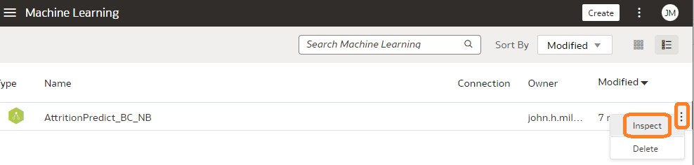

12. We can inspect the model to see more details like the quality of the model (confusion matrix, precision, recall) and the generated datasets. The quality tab identifies the overall quality of the model using a series of Related measurements: The overall accuracy of the model is 87% and the accuracy is 65%.

    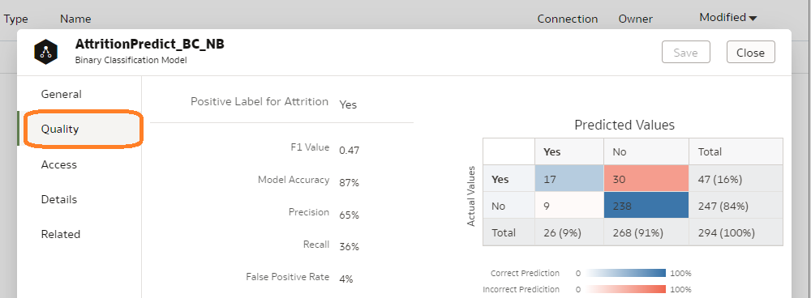

13. Since the model achieved an accuracy rate of 87%, let's apply it to a dataset of employees who remain with our organization to see which of them might be inclined to leave. Click on the three dots at the top right, then select *Import Workbook/Flow*.

    

14. select the *Employee-Analysis.dva* file.

    

15. Enter the password *“Admin123”*.

    

16. Find and open the workbook titledé Employee Analysis. Here we have an existing workbook that profiles 470 employees within our organization. We will apply our new classification training model to this dataset that we imported with this workbook.

    

17. Go to the Home tab and create a new *data flow*.

    

18. Select the new “Attrition Predict” dataset.

    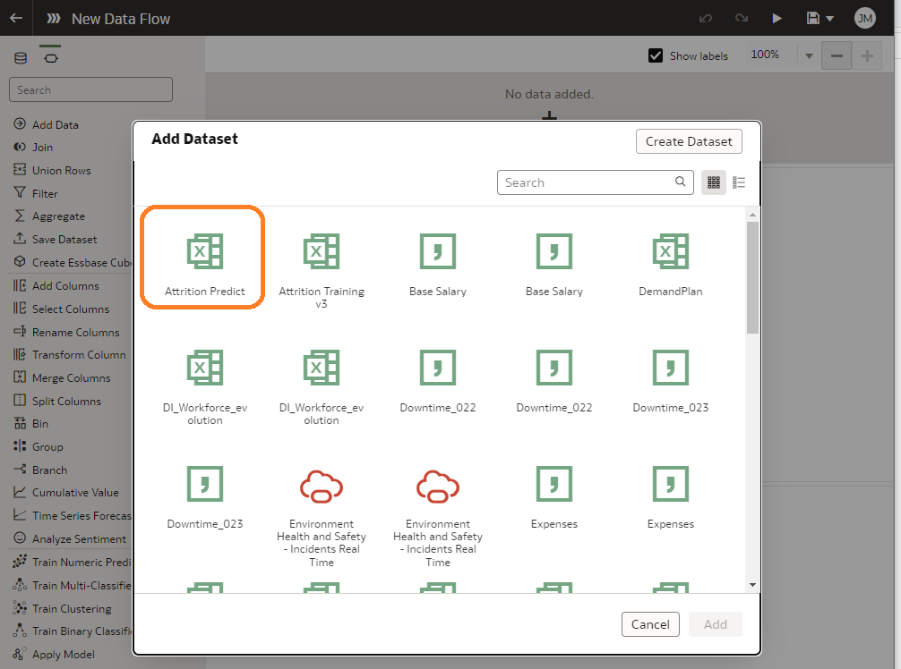

19. Click on the *plus icon* icon.

    

20. Select *Apply Model*.

    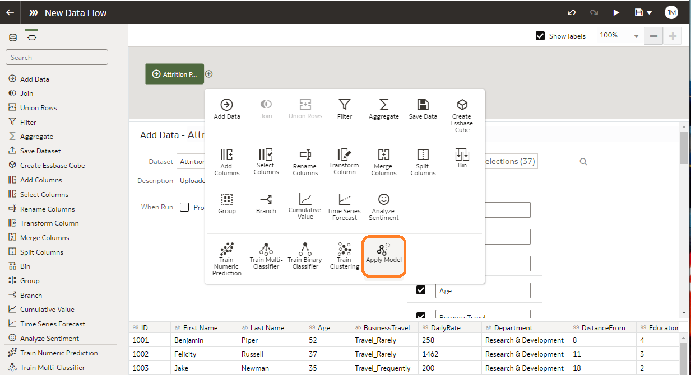

21. Select our Machine Learning model and click OK.

    

22. Our application template will have 3 sections.
    - **Outputs** - this is a list of columns returned by the model in addition to the input columns. Applying the model will enrich our employee dataset by adding a predicted value and a prediction confidence score.
    - **Parameters** - Optional parameters that users can pass to apply the template.
    - **Inputs** - These are the template input columns for the "apply".

        The application model will attempt to automatically match the input dataset column names to the model column names.

        

23. Select the *plus icon* and select *Save Data*.

    

24. Give it the name “AttritionPredicted”.

    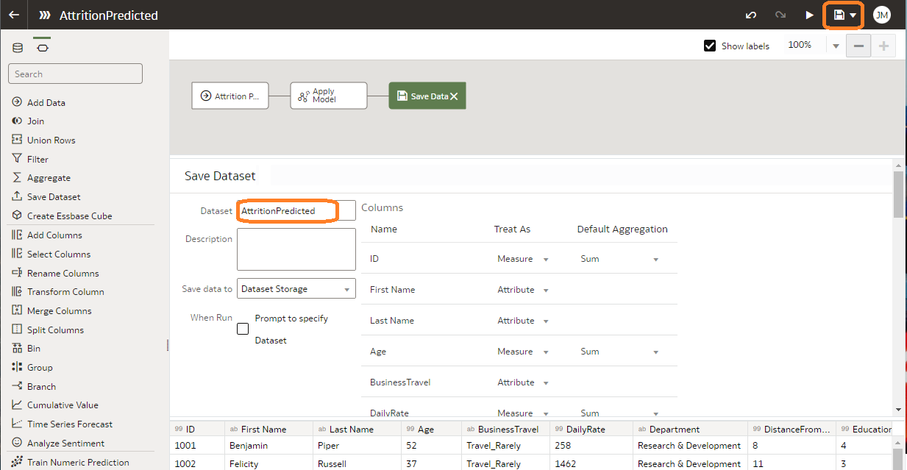

25. **Note**: We can run this data flow in an existing database if we want. For now, this is the default storage for datasets.
26. Save the data flow under the name “AttritionPredicted”.

    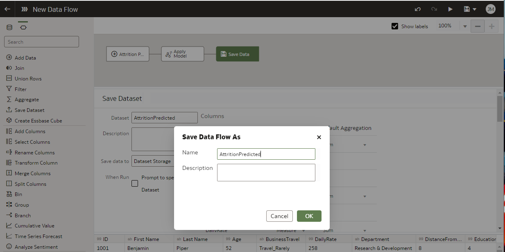

27. Once the data flow is saved, run it.

    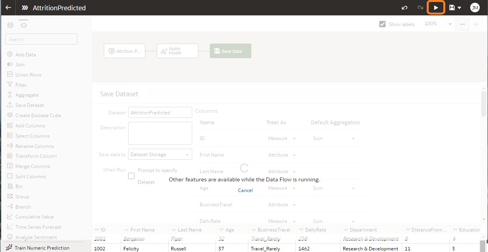

    This will produce a new dataset that will add the predicted values ​​to our existing dataset.

28. Go to the “Data” tab and select the new “AttritionPredicted” dataset.

    

29. Some columns may be stored incorrectly. As we did in the previous exercises, make sure that:

The following columns are stored as measures:

- PredictionConfidence
    -EmployeeCount
    - Employee number is an attribute.

        

30. Create visualizations like the following example:
    - Performance Tile for EmployeeCount
    - Donut chart for EmployeeCount by JobRole and Department
    - Table with columns EmployeeNumber, First Name, Last Name, PredictionConfidence, PredictedValue

        

31. Save the workbook naming it “AttritionPredicted”.

    

## Leverage machine learning in Oracle database to predict voluntary departures

This exercise will explore how to leverage learningautomatic Oracle Database (OML) from Oracle Analytics Server. The main difference from the previous exercise is that we used a native machine learning model running in OAS to predict attrition. While this approach works well with limited amounts of data, it is not necessarily optimal when working with large amounts of data. Oracle Database offers distinct performance advantages for hosting machine learning workloads that Oracle Analytics Server simply cannot match. Oracle database can leverage in-memory constructs, parallel processing, sophisticated query plans, and more. to provide a very robust environment for machine learning workloads. It is also common in the industry for a professional development team to train, test, evaluate, and deploy machine learning models in a robust dedicated compute environment such as Oracle Database. Our goal in this exercise is therefore to illustrate how an analyst can easily and quickly exploit the machine models hosted in the Oracle database from Oracle Analytics Server.

In this scenario, we will start by saving a machine learning model that our professional scientists have previously trained, tested and deployed into the Oracle database. Once saved, we will call this model to predict who in our organization is likely to leave the organization.

For this exercise, we will reuse the connection created in exercise 2 of the previous chapter. We will create a Dataset from this connection. The employee data needed to predict who might leave our organization is already in our Oracle database

**Note**: To fully leverage the capabilities of OML, both the machine learning model and the data needed to make a prediction must be in the Oracle database

1. From Home, Click on Create then choose Dataset

    

2. Select the ‘orclpdb’ connection, select the EMPLOYEE_DATA table in the dmuser01 schema, then drop it into the panel on the right of the screen.

     

3. Change the Age and EmployeeNumber columns to attribute and save the dataset with the name EMLOYEE_DATA.
4. Return to Home, and at the top right, click on the three vertical dots to open the drop-down menu, then select Register ML Model.

    

5. Select the orclpdb connection that was created at the beginning of the chapter.

    

6. Now select “*ATTRITION-MODEL-SVM*” from the list of available ML models and click Register at the bottom of the page.

    

7. From the home page, click the hamburger button at the top left, select Machine Learning, and for the ATTRITION-MODEL-SVM model we just saved, select the Inspect option using the three vertical points that appear on the right side of the model.

    

8. Inspectr the saved model. Note that there is more metadata appearing on OML models hosted in the Oracle database than on native ML models hosted in Oracle Analytics Server. This shows that OML models are much more sophisticated. Browse the different tabs (General, Access, Details, Related). Notice that under Details - Exit Columns there is a Prediction and a PredictionProbability which will tell us who is likely to leave next. Likewise, the Related tab offers a series of underlying metadata stored in DM\$ views within the Oracle database, containing important details about how the model was trained, tested, and evaluated

    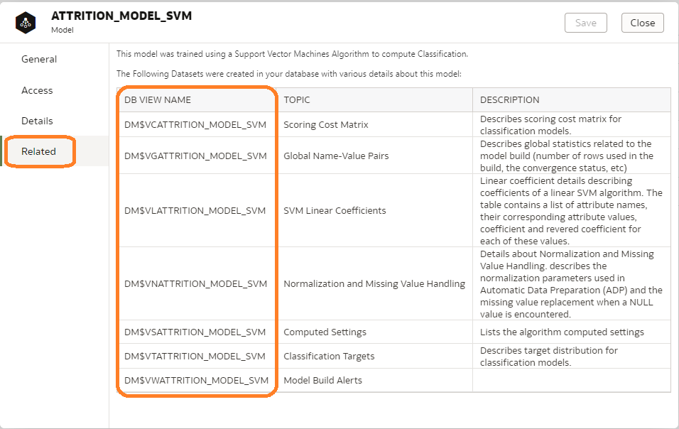

9. Our saved OML model is now ready to be called by Oracle Analytics Server to make predictions about which employees are likely to leave the organization. To call this saved OML model, click Create at the top right of the page, then choose Data Flow.

    

10. The authoring data flow will ask you which dataset(s) you want to use. Type "EMP" in the search window, then select EMPLOYEE-DATA and Add to enter a dataset containing key information about the remaining employees still working for our organization.

    

11. Click the + sign to the right of the EMPLOYEE_DATA node we just added to the dataflow and choose Apply Model at the bottom of the elements presented.

    

12. Select ATTRITION-MODEL-SVM that we saved in step 6 above, then click OK.

    

13. Since a similar dataset was used to train and test our model, the Prediction and PredictionProbability outputs are automatically mapped to the input columns needed to create our predictions.

    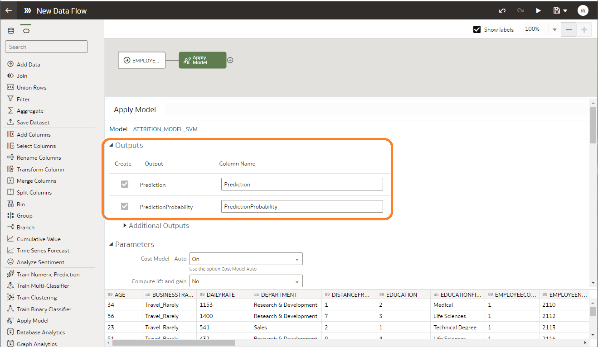

14. Click the + sign to the right of the Apply Model node and choose Save Data

    

15. Save the new dataset in the orclpdb database with the name PRED_EMP_ATTRIT. Give this name also for the dataset.

    

16. Save your data flow naming it PRED-EMP-ATTRIT-OML then, using the arrow at the top right of the page, run the dataset to create the predictions.

    

17. Once the model has been applied, exit the data flow you have just created.
18. Using the hamburger icon at the top left of the page, open the DATA panel and enter EMP to see all datasets with "EMP" in their name. Click on the PRED-EMP-ATTRIT dataset to create a new workbook.

    

19. Select all columns in the dataset, right-click and select Pick Visualization. Then choose the Table visualization to view the predictions.

    

20. Using the drag and drop techniqueser, rearrange the columns in each row so that Prediction, PredictionProbability, and EmployeeNumber appear on the right side of the table. You can also move key attributes such as DEPARTMENT, JOBROLE, ... to the right side.

    

21. Click the Prediction attribute and drag it to the Filters section at the top of the page, then filter only on employees whose prediction is Yes, meaning they are likely to leave. Then sort based on “PredictionProbability” from top to bottom to see which employees have the greatest risk of leaving.

    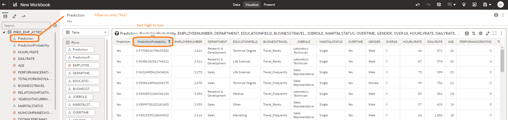

22. Continue building visualizations that you think might help understand attrition predictions until you have an interesting canvas.

    